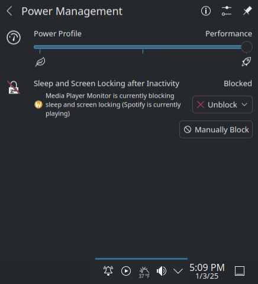

# KDE Media Sleep Block
Prevent Sleep while Media is playing in KDE

[Original Blog Post](https://xdxa.org/2025/prevent-sleep-while-media-is-playing-in-kde/)

## Description

When the script is running, whenever you start playback of music, the script inhibits locking the screen, which can be seen in the screenshot below:

## Installation

Copy the `media-player-inhibit-sleep.py` script into a folder, e.g., `~/.bin`. Set it as executable, and added it to start on login via:

1. Launch KDE's "System Settings"
2. Search "Au­tostart"
3. Click "Add New"
4. Select "Login Script"
5. Select the path to your script
